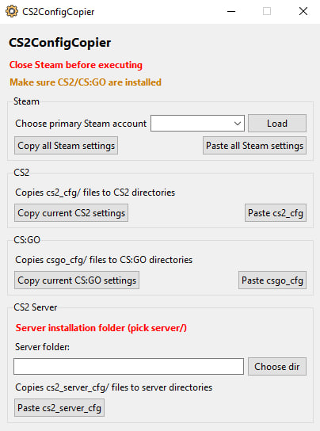
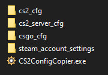

# CS2ConfigCopier

## Overview

**CS2ConfigCopier** is a Windows tool for quickly saving and copying your **CS2**, **CS2 server**, **CS:GO** and **Steam account** settings into the correct folders for all Steam accounts automatically.

It is meant for people who want to keep their CS2, CS2 server, CS:GO, Steam configs organized, restore settings faster, and reuse the same setup across multiple Steam accounts without manually copying files into each directory and preserving Steam settings like Invisibility mode and other Steam-related/game-related settings if you reinstall/delete Steam completely.

You can download the latest version here: [Releases](https://github.com/opalgeorgii/CS2ConfigCopier/releases)
---

You can view the screenshots here: [Screenshots](#screenshots)
---

## Important

**Close Steam completely before executing the program.**

If Steam is still running, some files may not copy correctly, or Steam may overwrite them after the program finishes.

---

## Usage

The program automatically locates Steam no matter where it is installed, finds the installed game folders and saves or copies the files into the correct folders for **ALL** Steam accounts that you have logged in on the PC.

- Download the latest version from [Releases](https://github.com/opalgeorgii/CS2ConfigCopier/releases)
- Configure CS2/CS:GO/Steam settings manually ONCE for your primary account and configure ONLY Steam settings if you have other accounts (skip this step if everything is already configured)
- Exit/Close the Steam completely
- Open the CS2ConfigCopier.exe and press on the 'Load' button to load all your current Steam account ids
- Select the ID which corresponds to your primary account (if you don't know your Steam id use the [Steam32ID](https://steamid.xyz/) and paste your Steam profile)
- Click on "Copy all Steam settings" to copy all Steam settings from all accounts into steam_account_settings/ folder that will be created
- Click on "Copy current CS2 settings" or "Copy current CS:GO settings" respectively to copy all config files from CS2/CS:GO from the Primary account that you chose
- In case you don't need cs2_cfg/ or cs2_server_cfg/ or csgo_cfg/ or steam_account_settings/ folders you can delete them
- Inside each of the first 3 folders you will find additional_configs/ folder or other files that you may want to replace or delete if you want I created those configs for myself, so feel free to use them as well.
- It is highly recommended not to delete base folders like cs2_cfg/ or cs2_server_cfg/ or csgo_cfg/. It is better to just remove the files in them but that is not mandatory.
- Once you copied all the configs you are all set! You just need to save those folders with your settings somewhere. Next time you reinstall Windows or be at any computer club or for any reason your settings get reset you can retrieve your saved folders, open the CS2ConfigCopier.exe and click on etther: "Paste all Steam Settings" or "Paste cs2_cfg" or "Paste csgo_cfg"
- Also a small notice, better don't touch default_configs/ folder, but feel free to delete/replace anything else. And keep the same folder structure that you have in the downloaded project.
- Finally, open Steam when everything has copied succesfully

---

## Recommended Setup

A practical way to use this project is to keep the provided structure and simply replace the included files with your own.

Recommended approach:

- keep the folder structure unchanged
- replace existing config files with your own versions
- remove files you do not need
- leave unrelated folders in place for easier maintenance

This makes the project easier to update and avoids breaking the intended layout.

**Only the files that exist in your project folders are copied.**

---

## Notes

- Works with multiple Steam accounts on the same PC
- Missing files or folders are skipped and therefore not copied
- Only the files you keep in the project structure are copied
- If Steam, required game folders, or config folders cannot be found, the program will show an error popup
- For `.exe` usage, keep the expected folder structure in the correct relative location
- Close the Steam completely before executing anything

### CS:GO Danger Zone Note

If you use a **Danger Zone cfg** for CS:GO, it needs to be applied in the correct order to work properly:

1. execute it in the **main menu before loading the map**
2. execute it **again after the map has loaded**

If you do not do the first step, CS:GO will crash.

---

## Screenshots

### Main Window

- show the main application layout

### Folder Structure

- show the expected project structure

---

## Requirements

- **Windows**
- **Steam installed**
- **Counter-Strike 2 and/or CS:GO installed**
- Python only if you want to run the `.py` file directly

If you use the compiled `.exe`, Python is not required.

---

## Support

If you would like to support me, you can donate here:

**[Donate via Donatello](https://donatello.to/opalgeorgii)**

---

## Related Project

For my Counter-Strike 2 plugin project, see:

- [WallhackPluginCS2](https://github.com/opalgeorgii)

---

## Contact

If you find bugs or want to suggest improvements, open an issue in the repository.